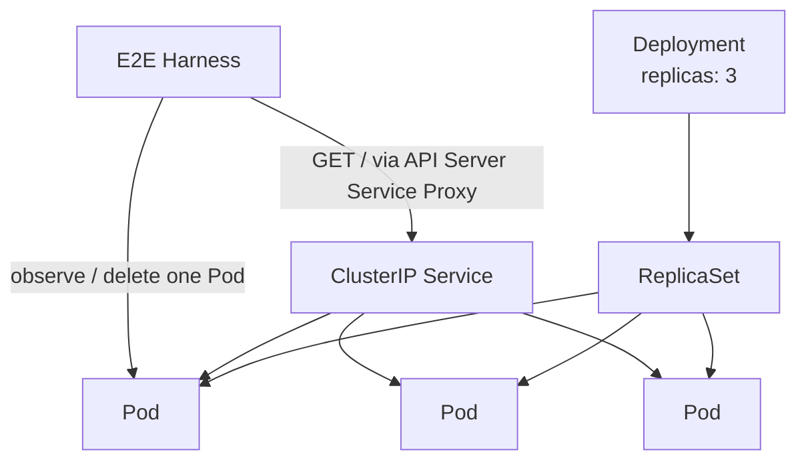
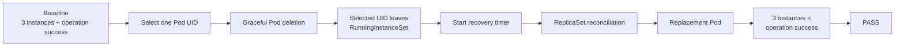

# Reliable Development Platform

[](https://github.com/sasakisenhi/reliable-dev-platform/actions/workflows/self-healing.yml)

Developer が環境の復旧・健全性確認・更新確認に過度な注意を払わず、  
アプリケーション開発へ集中できる状態を目指す Platform Engineering / Platform QA の実験的プロジェクトです。

単に Kubernetes 上でアプリケーションを動かすことではなく、

> **Platform が担うべき責務を定義し、その能力を観測可能・再現可能な条件で検証する**

ことを中心に開発しています。

---

## Problem

個人開発や小規模な開発環境では、Developer がアプリケーション開発だけでなく、次のような環境管理も担当しがちです。

- 実行状態の確認
- 障害発生時の復旧判断・復旧操作
- 不健全な実行環境の判別
- 更新後の正常性確認
- Platform 自体が期待どおり動いているかの確認

これらの責務が Developer 側に残るほど、アプリケーション開発以外の認知負荷が増えます。

本プロジェクトでは、この一部を Platform 側へ移します。

```text
Developer
  ├─ Application implementation
  ├─ Application testing
  └─ Platform usage
              │
              ▼
Platform
  ├─ Maintain expected runtime state
  ├─ Route only to healthy instances
  ├─ Preserve availability during updates
  └─ Expose verifiable platform quality
              │
              ▼
Platform QA
  └─ Reproducibly verify platform capabilities
```

より詳細な背景は [`docs/product-context.md`](docs/product-context.md) を参照してください。

---

# R1 — Self-Healing Runtime

**Status: Complete**

最初のIncrementでは、単一実行インスタンスの喪失に対する Self-Healing capability を対象にしました。

## Hypothesis

> Platform が期待実行数を維持し、正常状態から単一実行インスタンスが失われた後に自動で期待状態へ戻せるなら、そのシナリオにおける Developer の復旧判断と復旧操作を不要にできる。

この仮説を、Kubernetes の Deployment / ReplicaSet reconciliation と feature-specific E2E によって検証します。

---

## Architecture

R1では、意図的に小さな構成を採用しています。



主要な構成:

- Kubernetes `Deployment`
- Replica count: `3`
- Kubernetes標準の ReplicaSet reconciliation
- ClusterIP `Service`
- `agnhost:2.66.1` / `serve-hostname`
- kind single-node cluster
- Bash + kubectl による feature-specific E2E

custom controller / operator や汎用 chaos framework は導入していません。

R1の仮説を検証するために必要な最小構成を優先しています。

---

## Self-Healing Scenario

E2Eでは以下を再現します。



重要なのは、delete request を送った時点ではなく、

> **選択した Pod UID が RunningInstanceSet から外れたことを最初に観測した時点**

を recovery timer の起点としていることです。

Pod identity には `.metadata.uid` を使用します。

---

## Acceptance Criteria

Recovery completion は、同一観測 cycle 内で以下をすべて満たした場合に成立します。

```text
elapsed <= 120000 ms

AND

running instance count == expected replica count

AND

representative application operation == success

AND

selected Pod UID == absent
```

期待実行数は E2E 側へ重複してハードコードせず、対象 Deployment の `.spec.replicas` から取得します。

Application availability は Pod の `Ready` condition ではなく、Service 経由の代表操作で独立して確認します。

---

## RunningInstanceSet

R1では実行個体集合を次の条件で定義しています。

```text
Deployment selector matches
AND
metadata.deletionTimestamp is absent
AND
status.phase == Running
```

`Ready` condition は RunningInstanceSet には含めません。

これは、

```text
execution instance existence
```

と

```text
application availability
```

を別々の品質条件として観測するためです。

---

## Representative Operation

Application availability の代表操作には、

```text
GET /
```

を使用します。

対象は `agnhost serve-hostname` で、ClusterIP Service を Kubernetes API Server の Service proxy 経由で呼び出します。

これにより、R1では以下を追加せずに利用可能性を確認できます。

- NodePort
- Ingress
- host port mapping
- background `kubectl port-forward`
- probe用追加Pod

---

## Verification

R1では「自動復旧する」という表現だけで終わらせず、Capabilityを自動検証します。

### Self-tests

E2E harnessには固定入力による **23件のself-test** があります。

主な検証対象:

- baseline predicate
- resource setup deadline
- precheck deadline
- selected UID loss
- loss observation deadline
- transient operation failure
- same-cycle recovery
- `120000ms` inclusive boundary
- failure-stage mapping
- cleanup
- `KEEP_CLUSTER`

境界条件も明示的に検証しています。

```text
120000 ms → success allowed
120001 ms → failure
```

### Local E2E

実際の kind cluster 上でも acceptance scenario を確認しています。

Observed examples:

```text
instances=3 operation=success elapsed=1150ms
instances=3 operation=success elapsed=1160ms
```

これらは保証値ではなく、ローカル実行時の観測例です。

R1の acceptance threshold は、

```text
recovery <= 120000ms
```

です。

### CI

GitHub Actions の clean Linux environment でも同じ acceptance scenario を実行します。

CIでは以下を確認します。

```text
Bash syntax
↓
23 self-tests
↓
kind cluster setup
↓
R1 acceptance E2E
↓
git diff --check
```

R1の acceptance semantics はCI側で再定義せず、既存の

```bash
make test-self-healing
```

をそのまま使用しています。

---

## Failure Diagnostics

Acceptance failure は次のstageへ分類します。

| Stage | Meaning |
|---|---|
| `SETUP` | tool / cluster / fixture setup を完了できない |
| `PRECHECK` | 正常なbaselineを期限内に確認できない |
| `LOSS_INJECTION` | 単一Pod loss requestを完了できない |
| `LOSS_OBSERVATION` | 選択UIDの喪失を期限内に観測できない |
| `RECOVERY_DEADLINE` | recovery predicateが120秒以内に成立しない |

失敗時には Deployment / ReplicaSet / Pod / Event を read-only で出力します。

R1では generic evidence schema や generic PASS / FAIL framework は作成していません。これらは後続Incrementで扱います。

---

# Run R1 Locally

## Prerequisites

- Linux
- Docker
- Bash 5.x
- kind `v0.33.0`
- kubectl `v1.37.0`
- Make

Pinned Kubernetes environment:

```text
kind v0.33.0
kubectl v1.37.0
kindest/node:v1.37.0
agnhost 2.66.1
```

詳細な固定versionとdigestは [`research.md`](specs/001-self-healing-runtime/research.md) を参照してください。

## Self-test

```bash
tests/e2e/self-healing.sh --self-test
```

Expected:

```text
all 23 self-tests passed
```

## Acceptance E2E

```bash
make test-self-healing
```

成功時の出力例:

```text
selected pod: self-healing-xxxxxxxxxx-xxxxx uid=<uid>
loss observed: uid=<uid>
recovery complete: instances=3 operation=success elapsed=<0..120000>ms
```

すべての acceptance criteria を満たした場合だけ exit code `0` になります。

より詳しい実行方法は [`quickstart.md`](specs/001-self-healing-runtime/quickstart.md) を参照してください。

---

# Design Decisions

R1で重視した判断の一部です。

### Use Kubernetes reconciliation instead of building a controller

Pod lossからのreplacementは Kubernetes Deployment / ReplicaSet がすでに提供します。

そのためR1では custom controllerを作らず、Platform capabilityとして標準reconciliationを採用しました。

### Identify instances by Pod UID

Pod nameではなくUIDによって、元の個体とreplacementを明確に区別します。

### Separate runtime state from application availability

Podが`Running`であることと、アプリケーションが利用可能であることを同一視しません。

実行個体数と代表操作を独立して観測します。

### Start the timer from observed loss

delete requestの受付時刻ではなく、対象UIDがRunningInstanceSetを離れた観測を起点にします。

### Keep R1 feature-specific

R1では単一Capabilityの検証に必要な最小限だけを実装しています。

汎用E2E framework、generic evidence contract、audit attributionなどは後続Incrementへ延期しています。

詳細な理由・比較案・外部資料は [`research.md`](specs/001-self-healing-runtime/research.md) に記録しています。

---

# Repository Structure

```text
.
├── .github/
│   └── workflows/
│       └── self-healing.yml
│
├── docs/
│   └── product-context.md
│
├── platform/
│   └── kubernetes/
│       └── self-healing/
│           ├── kind.yaml
│           └── workload.yaml
│
├── specs/
│   └── 001-self-healing-runtime/
│       ├── spec.md
│       ├── research.md
│       ├── plan.md
│       ├── data-model.md
│       ├── quickstart.md
│       └── tasks.md
│
├── tests/
│   └── e2e/
│       └── self-healing.sh
│
├── Makefile
└── ROADMAP.md
```

---

# Development Approach

各Incrementでは、技術から始めるのではなく、

```text
Problem
→ Hypothesis
→ Requirement
→ Quality Condition
→ Technical Mechanism
→ Reproducible Verification
```

の順序を重視します。

Spec Driven Developmentには Spec Kit を利用し、Featureごとに仕様、Research、Plan、Task、Implementationを分離しています。

AI Agentも利用していますが、主要な設計判断、Kubernetesのmechanism、quality conditionについて人間が説明・レビューできる状態を維持することを開発方針としています。

---

# Roadmap

| Increment | Capability | Status |
|---|---|---|
| R1 | Self-Healing Runtime | ✅ Complete |
| R2 | Healthy Routing | Planned |
| R3 | Safe Rolling Update | Planned |
| R4 | Platform E2E | Planned |
| R5 | CI Quality Gate | Planned |

### R2 — Healthy Routing

次のIncrementでは、

> 「実行されていること」と「サービス提供可能であること」を分離し、不健全な実行インスタンスを利用経路から自動的に除外できるか

を検証します。

詳細は [`ROADMAP.md`](ROADMAP.md) を参照してください。

---

# Documents

プロジェクト全体の背景:

- [`docs/product-context.md`](docs/product-context.md)

R1:

- [Specification](specs/001-self-healing-runtime/spec.md)
- [Research / Technical Decisions](specs/001-self-healing-runtime/research.md)
- [Implementation Plan](specs/001-self-healing-runtime/plan.md)
- [Data Model](specs/001-self-healing-runtime/data-model.md)
- [Quickstart](specs/001-self-healing-runtime/quickstart.md)
- [Implementation Tasks](specs/001-self-healing-runtime/tasks.md)

Project roadmap:

- [`ROADMAP.md`](ROADMAP.md)
