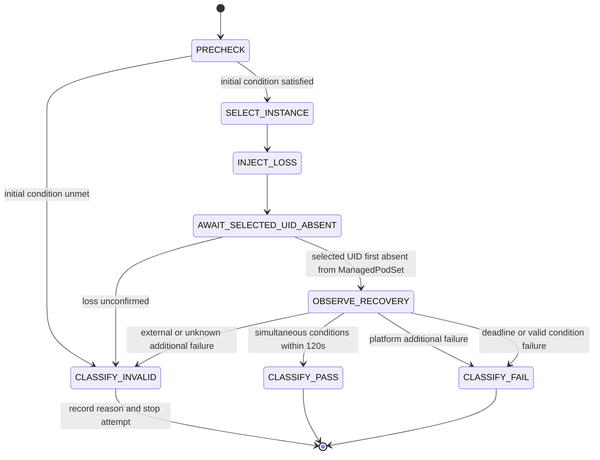

# Data Model: Self-Healing Runtime Verification

## Overview

この Feature は業務データベースを持たない。入力 contract、検証中の observation、最終 verdict、evidence 参照を immutable な記録として扱う。

## Entities

### ApplicationContract

Developer が定義・維持し、全 attempt で Platform QA が自動利用する。

| Field | Type | Rules |
|---|---|---|
| `schemaVersion` | string | `1.0` |
| `applicationId` | string | 空でない stable identifier |
| `expectedInstances` | integer | 1以上。MVP fixture は3 |
| `representativeOperation.argv` | array[string] | 1要素以上。shell string ではなく executable と引数を分離 |
| `representativeOperation.timeoutSeconds` | number | 0より大きい。各実行が残り recovery deadline を越えないよう runner が短い方を採用 |

Validation:

- 同じ serialized contract の SHA-256 digest を initial check と recovery check に利用する。
- contract は namespace、Pod name、Deployment nameなど Platform 内部の target を持たない。
- representative operation は exit code 0 のときだけ成功とする。
- runnerは代表操作の子processへ `KUBECONFIG=VerificationProfile.qaKubeconfigPath` を渡す。MVP fixtureはKubernetes API Service proxy経由でsample Serviceへ到達する。

### VerificationProfile

Platform QA が workload と観測方法を定義する。

| Field | Type | Rules |
|---|---|---|
| `schemaVersion` | string | `1.0` |
| `kubeContext` | string | 空でない context name |
| `namespace` | string | 空でない Kubernetes namespace |
| `deploymentName` | string | 空でない Deployment name |
| `recoveryThresholdSeconds` | integer | MVP では120に固定 |
| `lossObservationTimeoutSeconds` | integer | 1以上。quality timer 開始前の harness guard。超過は `LOSS_UNCONFIRMED` |
| `pollIntervalMilliseconds` | integer | 1以上。判定境界を変更しない観測間隔 |
| `artifactsDirectory` | string | repo root 相対の evidence 出力先 |
| `qaActorUsername` | string | 専用 ServiceAccount の audit username |
| `qaKubeconfigPath` | string | bootstrap が生成し runner が利用する専用 kubeconfig の host path |
| `auditLogPath` | string | kind から host へ mount された audit JSON Lines path |

Validation:

- 指定 Deployment の `.spec.replicas` は ApplicationContract の `expectedInstances` と一致しなければならない。
- selector は Deployment から取得し、profile に重複定義しない。
- `recoveryThresholdSeconds` は contract から変更できない。
- actorは`qaActorUsername`完全一致、固定したcontrol-plane identityまたはobserved node nameと一致するsystem identity、fixture専用の固定`DEVELOPER_TEST` identity、それ以外の`OTHER`の4区分とする。`DEVELOPER_TEST`はprofile fieldやcluster resourceを持たず、classifier fixture内だけで使う。Developer username一覧は持たず、`system:` prefixだけでsystem判定しない。

### PodInstance

1回の observation で得た実行個体。

| Field | Type | Rules |
|---|---|---|
| `name` | string | evidence 表示用。identity には使わない |
| `uid` | string | Kubernetes object identity。attempt 内で一意 |
| `ready` | boolean | Pod condition `Ready=True` か |
| `deletionTimestamp` | timestamp or null | null の場合のみ active 候補 |
| `phase` | string | 補助 evidence。active 判定を phase 単独で行わない |
| `ownerUid` | string | Deployment-managed ReplicaSet との所有関係確認用 |

`ManagedPodSet` は Deployment selector と ownership を確認できる全 Pod API object の UID 集合である。対象 UID の喪失は、その UID が `ManagedPodSet` から不在になった最初の観測で成立する。`deletionTimestamp` の付与だけでは成立しない。

`ActivePodSet` は `ManagedPodSet` のうち `ready=true` かつ `deletionTimestamp=null` の UID 集合である。`currentInstances` はこの集合の cardinality とする。

### OperationObservation

代表的な利用操作1回の結果。

| Field | Type | Rules |
|---|---|---|
| `startedAt` | RFC 3339 timestamp | wall-clock evidence |
| `completedAt` | RFC 3339 timestamp | wall-clock evidence |
| `durationMilliseconds` | integer | 0以上 |
| `exitCode` | integer or null | timeout / launch failure では null 可 |
| `success` | boolean | exit code 0 の場合のみ true |
| `stdoutRef` | path or null | artifact root 相対 path |
| `stderrRef` | path or null | artifact root 相対 path |
| `timedOut` | boolean | operation timeout の有無 |

### RecoveryObservation

復旧中の1回の判定 snapshot。代表操作の終了直後に取得した実行数と、直前の操作成功を束ねて同時成立を表す単位である。

| Field | Type | Rules |
|---|---|---|
| `sequence` | integer | attempt 内で0から単調増加 |
| `observedAt` | RFC 3339 timestamp | operation 終了直後に ActivePodSet を取得し終えた timestamp |
| `elapsedMilliseconds` | integer | first-absent monotonic origin からの経過。0以上 |
| `activePods` | array[PodInstance] | UID 重複なし |
| `currentInstances` | integer | `activePods` の件数と一致 |
| `expectedInstancesMatched` | boolean | current == expected |
| `operation` | OperationObservation | 各 recovery cycle の先頭で実行し、直後の count snapshot と束ねる |
| `recoveryComplete` | boolean | count 一致かつ operation.success、かつ elapsed <= 120000 の場合のみ true |

Capture order:

1. representative operation を実行する。
2. operation が終了した直後に `ManagedPodSet` と `ActivePodSet` を取得する。
3. count snapshot 完了時刻を `observedAt` とし、その単調時刻で `elapsedMilliseconds` を求める。
4. operation.success、current count 一致、`elapsedMilliseconds <= 120000` が同じ record 内で成立した場合だけ `recoveryComplete=true` とする。

### AdditionalFailure

意図した対象以外の追加障害と帰属証拠。

| Field | Type | Rules |
|---|---|---|
| `observed` | boolean | false の場合 attribution は `NONE` |
| `observedAt` | timestamp or null | observed=true なら必須 |
| `affectedUid` | string or null | 個体を識別できる場合に記録 |
| `attribution` | enum | `NONE`, `PLATFORM`, `EXTERNAL`, `UNKNOWN` |
| `details` | string or null | 観測事実。推測を記録しない |
| `evidenceRefs` | array[path] | snapshots / events / logs への相対参照 |

Classification:

- `PLATFORM` → 有効な `FAIL`
- `EXTERNAL` → `INVALID`
- `UNKNOWN` → `INVALID`
- `NONE` → 通常の recovery 条件で判定

Attribution mapping:

- Allowed injection: QA actorによる、選択UIDへの成功した1回の`delete pods`だけを除外する。
- Recovery intervention: 固定`DEVELOPER_TEST` actorによる、対象Podのcreate/delete/patch、対象Deploymentのscale変更、または限定したrestart annotation patch。`developerRecoveryInterventionObserved=true` とし有効なFAILにする。この分岐はfixtureだけで検証する。
- `EXTERNAL`: `OTHER` actorによる対象workload mutation、Rule 1の同一requestで説明されないbaseline後のDeployment generation変更、Node NotReady、またはAPI観測不能。
- `PLATFORM`: baselineの非選択active UIDの消失と、同じUIDへの`SYSTEM` actorの成功`delete pods` audit eventが1対1で一致し、EXTERNAL/介入signalがない場合だけ。
- `NONE`: 追加障害signalがなく、許可済みinjection以外の非system mutationがなく、generation、Node Ready、API観測が正常な場合。
- `UNKNOWN`: 必須field欠落、複数category一致、UID/時間窓不一致、または上記predicateへの完全一致なし。

意図したtarget deleteはQA actorの許可済みinjectionとして先に除外する。残るsignalをすべて収集し、cause categoryが1つだけ完全一致する場合に分類する。複数category一致は常に`UNKNOWN`とする。`OTHER`をDeveloperと推定せず`EXTERNAL`とする。Developerのread/list/get/watchは収集・判定対象にしない。

### VerdictReason

| Field | Type | Rules |
|---|---|---|
| `code` | enum | 下記 reason code のいずれか |
| `requirement` | string | 関連する `FR-xxx` |
| `message` | string | 観測値を含む人間可読な説明 |

Reason codes:

- `INITIAL_CONDITION_UNMET`
- `LOSS_UNCONFIRMED`
- `EXTERNAL_ADDITIONAL_FAILURE`
- `UNKNOWN_ADDITIONAL_FAILURE`
- `PLATFORM_ADDITIONAL_FAILURE`
- `DEVELOPER_RECOVERY_INTERVENTION`
- `RECOVERY_DEADLINE_EXCEEDED`
- `EXPECTED_COUNT_NOT_RECOVERED`
- `REPRESENTATIVE_OPERATION_UNAVAILABLE`

### TrialResult

1 attempt の最終的な判定 record。

| Field | Type | Rules |
|---|---|---|
| `schemaVersion` | string | `1.0` |
| `runId` | UUID | INVALID retry をまとめる execution identity |
| `attemptId` | UUID | attempt ごとに一意 |
| `applicationContractDigest` | SHA-256 string | 利用した contract の digest |
| `verificationProfileDigest` | SHA-256 string | 利用した profile の digest |
| `toolVersions` | object | Go、self-healing binary、kubectl、Kubernetes server、kindを記録 |
| `initialObservation` | object | expected/current、active UIDs、operation result |
| `selectedInstance` | PodInstance or null | injection 前に選択。precheck INVALID では null 可 |
| `lossRequestAcceptedAt` | timestamp or null | quality timer の起点ではない |
| `firstAbsentObservedAt` | timestamp or null | quality timer の起点 |
| `deadlineAt` | timestamp or null | firstAbsent + 120秒 |
| `completedAt` | timestamp or null | 同時成立した observation の時刻 |
| `elapsedMilliseconds` | integer or null | 完了または deadline 判定時の monotonic duration |
| `recoveryObservations` | array[RecoveryObservation] | 喪失後のcountとoperationを順序付きで保持。最終要素が最終実行数と復旧後利用可能性を表す |
| `developerRecoveryInputCount` | integer | CLIは試行中の復旧入力を受け付けないため常に0 |
| `developerRecoveryInterventionObserved` | boolean | true は有効な FAIL reason |
| `auditEvidenceRefs` | array[path] | 検証期間中の mutating request と actor を示す audit evidence |
| `additionalFailure` | AdditionalFailure | 常に存在 |
| `attributionPredicate` | enum or null | `RECOVERY_INTERVENTION`, `EXTERNAL`, `PLATFORM`, `NONE`, `UNKNOWN`。判定不能前はnull可。許可済みinjectionは分類前に除外する |
| `verdict` | enum | `PASS`, `FAIL`, `INVALID` |
| `qualityEvaluationIncluded` | boolean | INVALID のみ false |
| `rerunRequired` | boolean | INVALID のみ true |
| `reasons` | array[VerdictReason] | PASS は空、FAIL / INVALID は1件以上 |
| `evidenceRefs` | array[path] | NDJSON と raw snapshot への相対参照 |

## Relationships

```text
ApplicationContract ─┐
                     ├─> TrialResult attempt 1 (runId + attemptId, INVALID)
VerificationProfile ─┘
                     └─> TrialResult attempt N (same runId, new attemptId, PASS/FAIL)

TrialResult
├── InitialObservation
├── selected PodInstance
├── RecoveryObservation[]      (result.json内)
├── AdditionalFailure
├── VerdictReason[]
└── EvidenceRef[]
```

## State Transitions



## Evidence Layout

```text
artifacts/self-healing/<run-id>/
└── attempts/<attempt-id>/
    ├── result.json
    ├── commands.ndjson
    ├── audit.ndjson
    └── raw/
        ├── initial-pods.json
        ├── final-pods.json
        ├── deployment.json
        └── events.json
```

INVALID attempt は削除せず、`qualityEvaluationIncluded=false` として保持して終了する。runnerは環境を修復しない。初期条件が外部で回復した後、呼出元が同じrunIdと新しいattemptIdで再実行する。`execution.json` はFR/SCに不要なため作成しない。
